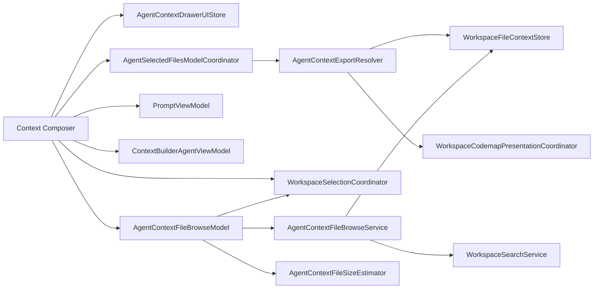

# Context Composer

This contributor guide covers the Agent Mode Context Composer, including selected-context review, prompt packaging, Copy Prompt, Context Builder, and the services that support them.

## Scope and goals

Context Composer lets a user review the context selected for the current agent chat, shape the prompt handed to another model, and run Context Builder without leaving the transcript.

The inspector renders a resolved view of the current selection and sends user changes through the shared workspace selection services. Repository lookup, codemap resolution, and selection persistence stay outside the view layer; [`source-layout.md`](source-layout.md) defines the source-ownership boundary.

Inspector visibility and navigation are scoped to the current app window. Selections, prompt settings, and Context Builder state use the feature's existing stores.

## User-facing behavior

### Open and close

Context Composer opens from the selected-context pill below the message composer or from `⌘P` (configurable under Settings → Keyboard Shortcuts → Toggle Context Composer). The selected-context pill is the only visible entry point: it opens **Selections**, switches to it from another Context Composer tab, or closes Context Composer when **Selections** is already active. The shortcut toggles Context Composer, and the header close control closes it directly.

The native macOS inspector column is resizable and adapts to preserve useful space for the chat.

### Selections

The **Selections** tab presents the context selected for the current agent chat, separating full and sliced files under **Files** from codemap-only entries under **Codemaps**. Users can filter by file name, path, root, or directory and sort by name or token count. Each row identifies its workspace root and selection mode, with token, context-percentage, and line-count metrics when available. Row actions support previewing, copying, removing, changing the selection mode, clearing slices, copying paths, opening files, and revealing files in Finder. **Clear** removes all displayed selections.

### Browse mode

**Add** in the Selections metarow swaps the tab content into an inline workspace browser; **Done** returns to selection review. Browse mode keeps the drawer header and its token pill visible, so the running budget total stays on screen while files are added.

The browser has four regions: a metarow with the browse title, transient notices, and **Done**; a search field that is focused on entry; a scope row with an **All roots** chip, one chip per loaded workspace root labeled through its logical projection, and an independent **Codemap** add-mode chip; and a bordered tree region. Roots start collapsed and expand lazily from store-backed records; `_git_data` never appears. A non-empty query replaces the tree with score-ranked results grouped by logical root and projected parent directory, capped at 300 files with a 120 ms debounce.

Enabled checkboxes mutate the current chat's selection immediately — one accepted click produces exactly one identity-bound selection transaction. A checked file shows a `Full`, `Slice`, or `Map` badge and unchecks to remove all of its explicit representations; an unchecked file adds in the active mode (full file, or codemap-only when the **Codemap** chip is on). Automatically inferred codemaps render an `Auto Map` badge with an unchecked, addable checkbox. Folder and root checkboxes remain loading and disabled until expansion has resolved their descendants and membership. Once known, container checkboxes are tri-state: a mixed or empty container adds only its currently unselected selectable descendants, and a fully selected container removes every descendant representation in one transaction. In codemap mode, files without codemap support are disabled with an explanation, and global codemap disablement disables the chip while keeping removal available.

Visible file rows request an approximate full-file token estimate derived from on-disk byte size. A single estimator scheduler shares a 16-read bound and deduplicated cache across concurrent requests. Folder estimates appear only when every descendant estimate is already known; expanding or rendering a container never scans file metadata to manufacture a total. Estimates in codemap mode stay visible but dimmed, because codemap cost is only known after selection. The header token pill remains the single running total and updates through the existing debounced recount after each mutation.

Keyboard behavior: up/down moves between interactive rows and transfers from search into the list, left/right expands or collapses a focused container, and Space toggles the focused row. When focus is in the search field or tree, Escape clears a non-empty query or exits browse mode. Checkboxes, disclosures, chips, and notices carry domain-specific accessibility labels, values, and live-region announcements.

Browse mode exits on Done, Escape with an empty query, drawer close, chat or Compose-tab switches, and lookup-context or worktree-binding changes. Selection changes for the same chat update checkbox state in place.

### Prompt

The **Prompt** tab combines receiving-model instructions with clipboard packaging controls: the Standard, Plan · Architect, Review, and Manual copy presets; stored prompts; and File Tree, Code Map, and Git options. Changing File Tree, Code Map, or Git selects the Manual preset. Copy Prompt uses the current prompt text and selection when clicked.

### Context Builder

The **Context Builder** tab explores the workspace, curates context within the configured budget, and produces Plan, Review, or Question output. Generated output can become the prompt, be copied or previewed, or open in the Agent Mode Oracle popover.

Context Builder's **Preview**, **Open Oracle**, and **View in Chat** actions open the follow-up conversation in the Agent Mode Oracle popover. The popover presents the conversation for reading, copying, reviewing reasoning and model usage, selecting text, and navigating the transcript. It stays synchronized with the follow-up chat.

### Loading behavior

When the active chat changes, Context Composer waits for the new chat's selection before showing rows and totals. During updates to the current chat, matching rows remain visible while their data refreshes. File and codemap counts become available independently, and metrics remain hidden until their values are known.

## Layering



`AgentModeDetailWithSidebarView` mounts the native inspector beside the chat. `AgentContextInspectorPresenter` connects its visibility to the presentation store, and `AgentContextControlDrawerView` owns the tab shell and selected-context model lifecycle.

## Invariants and rationale

**Observation isolation.** Context Composer detail state is observed within the inspector subtree. The chat surface receives only the presentation state and the action that opens Context Composer, keeping filter, sort, navigation, loading, and row updates from invalidating the transcript.

**Context Builder Oracle presentation.** Context Builder routes each follow-up conversation by workspace, tab, and chat. `AgentOraclePill` presents the shared chat transcript with its non-mutating action policy, while the chat session remains the source of truth for live message updates.

**Native inspector layout.** SwiftUI's `.inspector` owns width, resizing, cursor behavior, and resize persistence. `AgentContextInspectorColumnSizing` derives a bounded inspector width from the available detail width so the chat remains usable in narrow layouts.

**Context-aware loading.** `AgentSelectedFilesModelCoordinator` distinguishes the requested context, the context currently displayed, and any context being loaded. Rows are mutable only when the displayed data belongs to the active context and no replacement load is underway. A chat switch therefore withholds stale rows, while an update within the same chat can keep matching rows visible and read-only until the refresh completes.

**Current-state copying.** Copy Prompt flushes pending selection edits, reads the current prompt, and captures the active selection and worktree bindings when clicked. Cached lookup data is reused only when it belongs to that same context.

**Explicit readiness.** Counts and metrics carry readiness independently. Unknown values remain pending rather than appearing as zero, and the header token estimate appears only for a complete, current selection snapshot.

**Identity-bound browse mutations.** A browse session captures the chat's `WorkspaceSelectionIdentity` and `WorkspaceLookupContext` when it begins. `AgentContextInspectorPresenter` owns the retained browse model across drawer presentation and Files, Prompt, and Context Builder tab changes. The Files tab continuously updates that model with the current route proof, and an enabled checkbox click is accepted only when that proof matches the captured selection identity and lookup/worktree route. The accepted request then revalidates its store-derived records and applies one `setPreResolvedFilePathsInSelection` transaction against the captured identity. Done, Escape, drawer close, or a subsequent chat switch cancels presentation work but does not cancel that accepted transaction. Review-mode Add, Clear, and row actions for that identity remain disabled until its accepted browse mutations finish. Checkboxes derive purely from the authoritative selection projected through the captured lookup context — there is no optimistic UI state — so rejected clicks leave nothing stale, same-route selection refreshes update in place, and worktree-bound chats browse logical root names while mutating exact physical paths.

**Generation-fenced browse work.** Search, hierarchy loading, and token estimates all carry session and request generations; results publish only when both still match. Each hierarchy load obtains one root tree index and returns direct children plus descendants from the same applied root generation and catalog snapshot. A catalog-generation change fails the browse session closed and asks the user to select Done and browse again, so cached hierarchy and search results are never reconciled across catalog snapshots. Search, tree loading, and mutation revalidation preserve session-root unavailability as a typed browse state instead of presenting it as empty results or stale records, including when a worktree binding projection is not fully materialized. Chat switches, drawer close, switch blanking, and lookup-context changes end the browse session, cancel presentation work, and clear accepted model generations. The next browse session prunes service and estimator caches to its current route's roots. Accepted mutation requests continue through revalidation and their captured identity-bound transaction when the catalog remains current.

## State ownership

| Concern | Owner |
| --- | --- |
| Inspector visibility | `AgentContextDrawerPresentationStore` |
| Active tab, filter, and sort | `AgentContextDrawerDetailStore` |
| Open, close, and toggle behavior shared by Context Composer entry points | `AgentContextDrawerUIStore` |
| Selected files and active-tab mutations | `StoredSelection` and `WorkspaceSelectionCoordinator` |
| Instructions, copy configuration, and token counting | `PromptViewModel` |
| Context Builder execution and generated output | `ContextBuilderAgentViewModel` |
| Selected-context loading, readiness, caching, and mutation gating | `AgentSelectedFilesModelCoordinator` |
| Browse-session phase, query, scope, hierarchy, focus, notices, and mutation ordering | `AgentContextFileBrowseModel` |
| Store-backed browse roots, lazy tree indexes, search, and record revalidation | `AgentContextFileBrowseService` |
| File metadata reads and byte-size token estimates | `AgentContextFileSizeEstimator` |

## Selected-context model

`AgentContextExportViewContext` captures the active Compose tab, agent session, prompt, selection, and worktree bindings. `AgentContextExportResolver` maps that context to display rows, metrics, previews, and clipboard content. Selection changes return through `WorkspaceSelectionCoordinator`, which updates the active tab's `StoredSelection`. Metrics distinguish known values from values that are still loading.

## Copy pipeline

Copy Prompt assembles the clipboard content from a single snapshot of the active context:

1. Capture the current prompt, selection, worktree bindings, and matching lookup data.
2. Resolve stored prompts and Git review context.
3. Resolve the codemaps needed by the selected copy configuration.
4. Collect selected file content, project structure, and Git diff content.
5. Package the configured sections and write them to the pasteboard.

## Validation

Start with the focused suite for the boundary being changed:

```bash
make dev-test FILTER=AgentContextDrawerUIStoreTests
make dev-test FILTER=AgentContextInspectorColumnSizingTests
make dev-test FILTER=AgentContextFileBrowseServiceTests
make dev-test FILTER=AgentContextFileBrowseSearchParityTests
make dev-test FILTER=TokenCalculationServiceByteEstimateTests
make dev-test FILTER=WorkspaceSelectionPreResolvedMutationTests
make dev-test FILTER=AgentContextSelectedFileCardTests
make dev-test FILTER=GitViewModelSelectionClearTests
```

Selection-card presentation, token accounting, and Git actions have additional focused coverage in `AgentContextSelectedFileCardTests`, `TokenCalculationServiceByteEstimateTests`, and `GitViewModelSelectionClearTests`. Use the contribution matrix in [`../../AGENTS.md`](../../AGENTS.md) for repository-wide lint, build, and PR-ready gates. Because Context Composer is running-app Agent Mode UI, also follow the live CE MCP smoke flow there when behavior changes.

## References

- `Sources/RepoPrompt/Features/AgentMode/Views/AgentModeDetailWithSidebarView.swift` — native inspector mounting, presenter, and detail-width column policy.
- `Sources/RepoPrompt/Features/AgentMode/Views/ContextDrawer/` — Context Composer shell, tabs, selected-context rows, previews, and click-time export context.
- `Sources/RepoPrompt/Features/AgentMode/ViewModels/UI/AgentContextDrawerUIStore.swift` — presentation and runtime detail state.
- `Sources/RepoPrompt/Features/AgentMode/ViewModels/UI/AgentSelectedFilesModelCoordinator.swift` — context-aware loading, caching, readiness, and mutation gating.
- `Sources/RepoPrompt/Features/AgentMode/ViewModels/UI/AgentContextFileBrowseModel.swift` — browse-session lifecycle, selection projection, tri-state membership, and ordered immediate mutations.
- `Sources/RepoPrompt/Features/AgentMode/Views/ContextDrawer/AgentContextFileBrowseView.swift` — browse-mode metarow, search field, scope chips, tree and search rows, keyboard, and accessibility.
- `Sources/RepoPrompt/Features/AgentMode/Services/AgentContextFileBrowseService.swift` — store-backed root enumeration, lazy tree indexes, projected search, and mutation-time record revalidation.
- `Sources/RepoPrompt/Features/AgentMode/Services/AgentContextFileSizeEstimator.swift` — bounded-concurrency file metadata reads and byte-size token estimates.
- `Sources/RepoPrompt/Features/AgentMode/Services/AgentContextExportResolver.swift` — selection resolution, previews, metrics, and clipboard assembly.
- `Sources/RepoPrompt/Features/AgentMode/Services/AgentSelectedFilesDiagnostics.swift` — opt-in selected-context loading and readiness diagnostics.
- `Sources/RepoPrompt/Infrastructure/WorkspaceContext/Selection/WorkspaceSelectionCoordinator.swift` — active-tab selection mutation.
- `Sources/RepoPrompt/Infrastructure/WorkspaceContext/Presentation/WorkspaceCodemapPresentationCoordinator.swift` — codemap readiness and presentation coordination.
- [`source-layout.md`](source-layout.md) — source ownership rules for Agent Mode feature code and workspace-context infrastructure.
